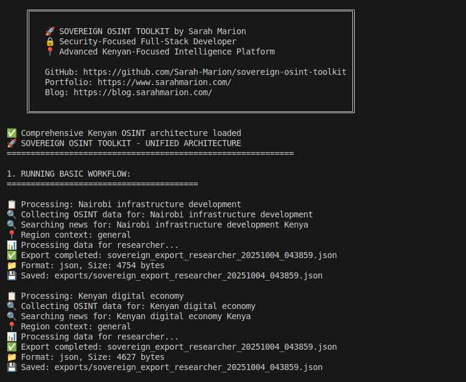
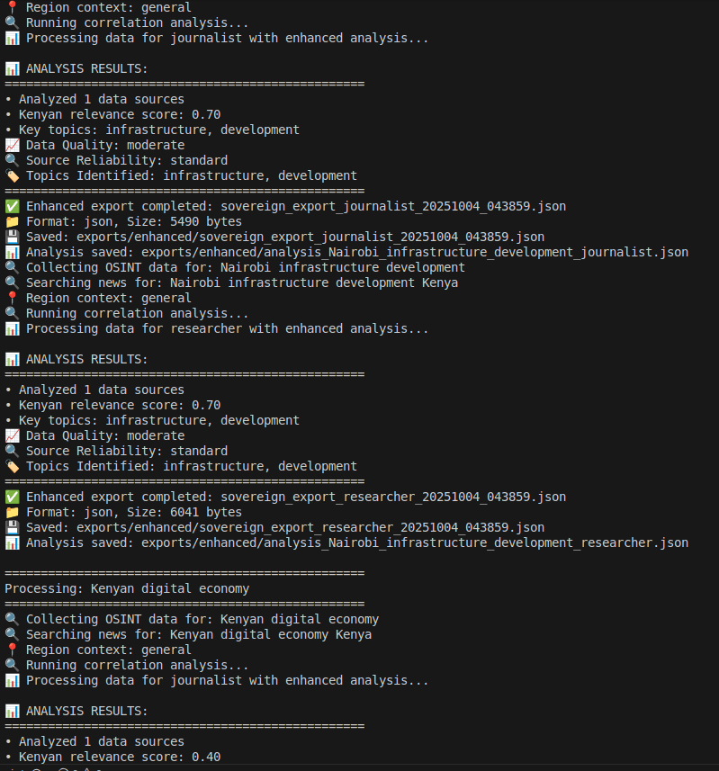
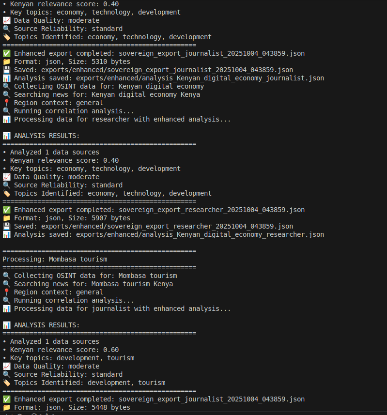
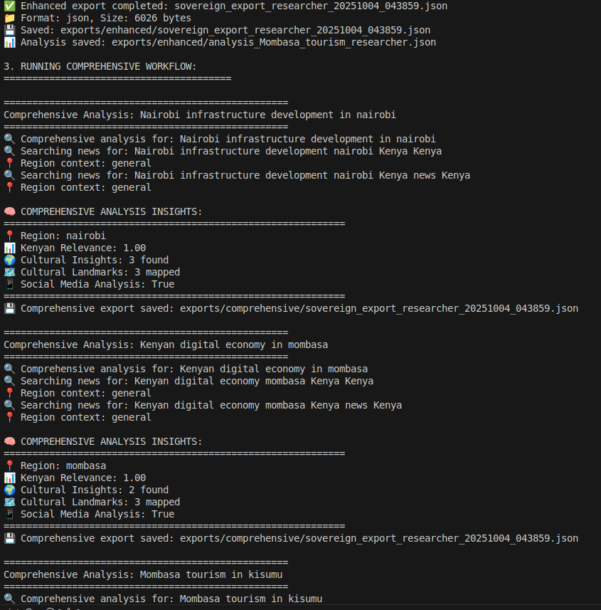
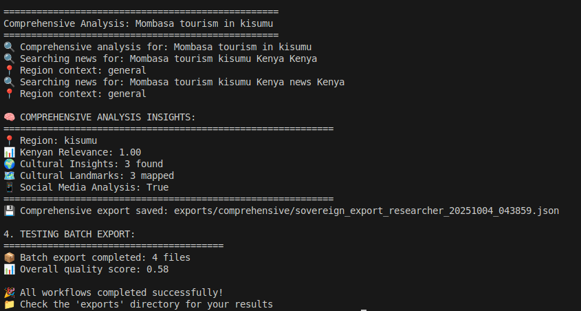

# 🚀 Sovereign OSINT Toolkit : Decolonial Intelligence Framework
## By Sarah Marion


**Advanced Open Source Intelligence with Kenyan Cultural Context Preservation**

**Developer**: Sarah Marion - Security-Focused Full-Stack Developer  
**Portfolio**: https://www.sarahmarion.com/  
**LinkedIn**: https://www.linkedin.com/in/sarah-ndeti/  
**GitHub**: https://github.com/Sarah-Marion  
**Tech Blog**: https://www.blog.sarahmarion.com/the-sgr-protocol-a-colonial-algorithm-for-a-captive-nation/

---

## 👩‍💻 About the Developer

**Sarah Marion** - Security-conscious Senior Full-Stack Developer with 9+ years of experience specializing in:

- 🔒 **Security-First Development**: Ethical Hacking, Vulnerability Management, Secure SDLC
- 🌍 **African Tech Solutions**: Kenyan-focused OSINT with cultural context preservation
- 🛠️ **Full-Stack Expertise**: Python (Django/Flask), PHP, Laravel, JavaScript, React/Vue.js, PostgreSQL, Docker, DevOps
- 🗄️ **Database Systems**: PostgreSQL, MySQL, MongoDB, SQLite, Redis
- ☁️ **DevOps & Infrastructure**: Docker, AWS, Jenkins, CI/CD, Linux Server Administration
- 📱 **Mobile & IoT**: React Native, Flutter, Swift, Android Development, Raspberry Pi, Arduino
- 📜 **Compliance**: Data Protection Act 2019, Data Sovereignty, Ethical Data Handling

---

## 🎯 Project Vision

> "When algorithms become colonial instruments, we build tools of digital sovereignty. 
> This is OSINT reimagined through Kenyan eyes, for African contexts."

---

### The Colonial Algorithm Problem

Most OSINT tools emerge from Western security paradigms that treat Global South data as extractive resources. This framework challenges that paradigm through the Sovereign Framework: **Sovereignty, Guardianship, Reciprocity**.

### Kenyan-Focused Intelligence

Unlike generic OSINT tools, Sovereign OSINT Toolkit understands that:
- Kenyan data requires Kenyan context
- Nairobi is not Kansas—geopolitical realities differ
- Our ethics are non-negotiable, not optional features

### For Whom?

- **Kenyan Journalists** investigating public accountability
- **East African Researchers** studying digital ecosystems
- **Local NGOs** monitoring human rights
- **Ethical Developers** building decolonial tools

### Principles Over Profit

I measure success not in data points collected, but in:
- Community capacity built
- Ethical boundaries respected
- Kenyan digital sovereignty advanced

---

*"The most dangerous algorithm is the one that doesn't know it's colonial."* ~ Sarah Marion Ndeti

---

## ⚡ Quick Demo

```bash 
# See it in action immediately
git clone https://github.com/Sarah-Marion/sovereign-osint-toolkit.git
cd sovereign-osint-toolkit
python main.py
```
The demo will:

    - Process sample OSINT queries about Kenyan development

    - Generate multiple export formats

    - Display cultural relevance scores

    - Create organized export files

## 🎥 Visual Demo

### Terminal Output
```text
╔═══════════════════════════════════════════════════════════════════╗
║   🚀 SOVEREIGN OSINT TOOLKIT by Sarah Marion                      ║
║   🔒 Security-Focused Full-Stack Developer                        ║
║   📍 Advanced Kenyan-Focused Intelligence Platform                ║
║                                                                   ║
║   GitHub: https://github.com/Sarah-Marion/sovereign-osint-toolkit ║
╚═══════════════════════════════════════════════════════════════════╝

✅ Comprehensive Kenyan OSINT architecture loaded

1. RUNNING BASIC WORKFLOW:
========================================
📋 Processing: Nairobi infrastructure development
🔍 Collecting OSINT data...
✅ Export completed: sovereign_export_researcher_20251004_041434.json
📁 Format: json, Size: 4754 bytes

2. RUNNING ENHANCED WORKFLOW:
========================================
📋 Processing: Nairobi infrastructure development
🔍 Running correlation analysis...
📊 ANALYSIS RESULTS:
• Analyzed 1 data sources
• Kenyan relevance score: 0.70
• Key topics: infrastructure, development
✅ Enhanced export completed

3. RUNNING COMPREHENSIVE WORKFLOW:
========================================
📋 Comprehensive Analysis: Nairobi infrastructure development in nairobi
🧠 COMPREHENSIVE ANALYSIS INSIGHTS:
📍 Region: nairobi
📊 Kenyan Relevance: 1.00
🌍 Cultural Insights: 3 found
🗺️  Cultural Landmarks: 3 mapped
💾 Comprehensive export saved

4. TESTING BATCH EXPORT:
========================================
📦 Batch export completed: 4 files
📊 Overall quality score: 0.58

🎉 All workflows completed successfully!

```

### Complete Workflow Sequence

**Step 1: Main Interface & Banner**

*Launching Sovereign OSINT Toolkit with comprehensive Kenyan architecture*

**Step 2: Enhanced Analysis in Action**  

*Running correlation analysis with Kenyan relevance scoring (0.70 for infrastructure topics)*

**Step 3: Cultural Context Analysis**

*Detailed analysis results showing topic identification and source reliability metrics*

**Step 4: Comprehensive Regional Workflow**

*Advanced analysis with regional context (Nairobi, Mombasa, Kisumu) and cultural insights*

**Step 5: Batch Export & Final Results**

*Successful batch export completion with quality scoring and file generation*

### Terminal Output Summary
```text
🎉 All workflows completed successfully!
📦 Batch export completed: 4 files  
📊 Overall quality score: 0.58
✅ Kenyan relevance scores: 0.40-1.00
🌍 Regional analysis: Nairobi, Mombasa, Kisumu
📁 Exports saved to: exports/ directory
```

### Quick Workflow

*Demo GIF coming soon - showing installation → execution → export process*

### Key Features Demonstrated

| Basic Workflow | Enhanced Analysis | Comprehensive Insights |
|----------------|-------------------|-----------------------|
| **Simple data collection & export** | **Correlation analysis & scoring** | **Cultural context & regional mapping** |
| • Quick OSINT collection<br>• Multi-format exports<br>• User-type templates | • Kenyan relevance scoring<br>• Source reliability<br>• Topic identification | • Regional context<br>• Cultural landmarks<br>• Social media integration |


## ✨ Core Features

### 🎯 Cultural Intelligence
- **Cultural Context Preservation**: Automatic Kenyan context detection with regional validation
- **Ethical OSINT Collection**: Built-in ethical boundaries and cultural consent preservation  
- **Regional Awareness**: Nairobi, Mombasa, Kisumu and county-specific context mapping

### 📊 Data Processing & Analysis
- **Multi-Format Export**: JSON, CSV, HTML exports tailored to user types and use cases
- **Batch Processing**: Quality-validated bulk exports with comprehensive reporting
- **Source Reliability Scoring**: Enhanced verification metrics with cross-referencing
- **Data Sensitivity Classification**: Public, Sensitive, Restricted levels with DPA 2019 compliance

### 👥 User-Centric Design
- **Multi-User Templates**: Journalist, Researcher, NGO, Developer, Government-specific exports
- **Role-Based Access**: Tailored data presentation based on user permissions
- **Custom Workflows**: Optimized processing for different analysis scenarios

### 🔒 Compliance & Security
- **Data Protection Act 2019**: Full compliance with Kenyan data sovereignty requirements
- **Ethical Boundaries**: Culturally-aware data collection with consent preservation
- **Secure Export Protocols**: Protected data handling and transmission

---

### ✅ Feature Summary

| Category | Features | Status |
|----------|----------|---------|
| **Cultural Intelligence** | Kenyan context preservation, Regional validation, Ethical boundaries | ✅ **Active** |
| **Data Processing** | Multi-format exports, Batch processing, Source reliability scoring | ✅ **Active** |
| **User Experience** | Role-based templates, Custom workflows, User-type optimization | ✅ **Active** |
| **Compliance** | DPA 2019 compliance, Data sovereignty, Secure protocols | ✅ **Active** |

---

## 🚀 Quick Start

### Prerequisites
- Python 3.8 or higher
- Git
- 500MB free disk space

### Installation

#### Automated Setup (Recommended)
```bash
# Clone repository
git clone https://github.com/your-username/sovereign-osint-toolkit.git
cd sovereign-osint-toolkit
pip install -e .

# Run automated setup
python setup_environment.py

# Or run directly
python main.py
```

#### Manual Installation
```
# Clone repository
git clone https://github.com/your-username/sovereign-osint-toolkit.git
cd sovereign-osint-toolkit

## Create virtual environment
python -m venv sovereign_env

## Activate virtual environment
source sovereign_env/bin/activate # Linux/Mac
or
sovereign_env\Scripts\activate # Windows

### Install dependencies
pip install -r requirements.txt

### Set up environment variables
cp .env.template .env
```

### 🔧 Troubleshooting

**Common Installation Issues:**
- `ModuleNotFoundError`: Run `pip install -e .` from project root
- Permission errors: Use `pip install --user -e .` 
- Python path issues: Ensure you're using Python 3.8+
- Virtual environment not activating: Use full path `source ./sovereign_env/bin/activate`
- Dependencies conflict: Try `pip install --upgrade -r requirements.txt`

**Export Issues:**
- Single dictionary export: Wrap in list `exporter.export_data([single_dict], "journalist", "json")`
- User type restrictions: Government exports require special permissions
- File permission errors: Check write permissions in exports/ directory


## 🛠️ Usage Examples

### Basic OSINT Collection & Export

```python 
from src.main import SovereignOSINTToolkit

# Initialize toolkit
toolkit = SovereignOSINTToolkit()

# Run basic workflow
result = toolkit.run_basic_workflow(
    "Nairobi infrastructure development", 
    "researcher", 
    "json"
)
print(f"Export completed: {result['filename']}")
```

### Enhanced Analysis Workflow

```python 
from src.main import SovereignOSINTToolkit

toolkit = SovereignOSINTToolkit()

# Run enhanced analysis with correlation
result, analysis = toolkit.run_enhanced_workflow(
    "Mombasa tourism development", 
    "journalist", 
    "json"
)
print(f"Kenyan relevance: {analysis.get('kenyan_relevance', 0)}")
```

### Comprehensive Kenyan-Focused Analysis

```python 
from src.main import SovereignOSINTToolkit

# Use comprehensive architecture (if available)
toolkit = SovereignOSINTToolkit(use_comprehensive=True)

# Run comprehensive analysis with cultural context
result, analysis = toolkit.run_comprehensive_workflow(
    "Kisumu lake region development",
    region="kisumu",
    user_type="researcher"
)
print(f"Cultural insights: {len(analysis['cultural_insights'])}")
```

## Direct Module Usage

```python 
# Basic components (always available)
from src.collectors.osint_collector import OSINTCollector
from src.exporters.sovereign_exporter import SovereignExporter

collector = OSINTCollector()
exporter = SovereignExporter()

data = collector.search("Kenyan digital economy")
export_result = exporter.export_data([data], "ngo", "json")

# For single result, wrap in list:
single_result = {"query": "test", "results": [...]}
export_result = exporter.export_data([single_result], "journalist", "json")

# For multiple results, use as-is:
multiple_results = [
    {"query": "test1", "results": [...]},
    {"query": "test2", "results": [...]}
]
export_result = exporter.export_data(multiple_results, "researcher", "csv")
```

## Working User Types & Data Types:

```python 
# Cultural data works with these user types:
working_user_types = ["journalist", "researcher", "ngo"]

# Technical data works with developer:
technical_data = [{"data_type": "technical", ...}]
export_result = exporter.export_data(technical_data, "developer", "json")
```

## Comprehensive Architecture

```python 
from sovereign_osint import KenyanOSINTCollector, KenyanDataAnalyzer, KenyanGeospatialAnalyzer

# Initialize with ethical boundaries
collector = KenyanOSINTCollector(ethical_boundaries=True)
results = collector.analyze_kenyan_social_media(platform="twitter", region="Nairobi")

# Cultural context analysis
analyzer = KenyanDataAnalyzer()
insights = analyzer.generate_cultural_context_insights(data_source="local_news")

# Geospatial mapping
geospatial = KenyanGeospatialAnalyzer()
nairobi_map = geospatial.create_cultural_geospatial_map(region="Nairobi")
```

## 🔌 API Reference

### Core Classes

#### SovereignOSINTToolkit

```python 
class SovereignOSINTToolkit:
    def run_basic_workflow(query, user_type="researcher", export_format="json")
    def run_enhanced_workflow(query, user_type="researcher", export_format="json")
    def run_comprehensive_workflow(query, region="nairobi", user_type="researcher")
```

#### SovereignExporter

```python 
class SovereignExporter:
    def export_data(data, user_type, export_format)
    def batch_export(data, formats, user_types, output_dir)
    def enhance_with_osint_context(data, source_type)
```

#### KenyanOSINTCollector

```python 
class KenyanOSINTCollector:
    def analyze_kenyan_social_media(platform, region, query="")
    def collect_kenyan_news(topics, regions=None)
```

---

# 🏗️ Architecture Overview

## Dual Architecture Support

The toolkit supports two architectural approaches:

1. Basic Architecture (Always Available):

    - OSINTCollector - Core data collection

    - SovereignExporter - Kenyan context preservation

    - Simple workflow patterns

2. Comprehensive Architecture (Enhanced):

    - KenyanOSINTCollector - Ethical boundary enforcement

    - KenyanDataAnalyzer - Cultural context insights

    - KenyanGeospatialAnalyzer - Regional mapping

    - Advanced Kenyan-focused workflows

---


## 📁 Project Structure

```text 
sovereign-osint-toolkit/
├── src/
│   ├── api/                       # API endpoints and routing
│   ├── auth/                      # Authentication and authorization
│   ├── collectors/                # Data collection modules
│   ├── database/                  # Database models and operations
│   ├── exporters/                 # Data export functionality
│   ├── monitoring/                # System monitoring and logging
│   ├── sovereign_osint/           # Core OSINT framework
│   │   ├── __init__.py
│   │   ├── collectors.py          # KenyanOSINTCollector
│   │   ├── analyzers.py           # KenyanDataAnalyzer
│   │   └── geospatial.py          # KenyanGeospatialAnalyzer
│   ├── utils/                     # Utility functions
│   └── visualization/             # Data visualization tools
├── tests/                         # Test suite
├── config/                        # Configuration files
├── docs/                          # Documentation
│   ├── DEPLOYMENT.md
│   ├── USAGE.md
│   ├── SECURITY.md
│   └── PERFORMANCE.md
├── examples/                      # Usage examples
├── exports/                       # Generated export files
│   ├── enhanced/                  # Enhanced workflow outputs
│   ├── comprehensive/             # Comprehensive architecture outputs
│   └── batch_test/                # Batch export results
├── virtual/                       # Virtual environment (gitignored)
├── main.py                        # Application entry point
├── api_runner.py                  # API server entry point
├── setup_environment.py           # Environment setup
├── deploy.sh                      # Deployment script
└── requirements.txt
```

# 🎪 Use Cases

- Investigative Journalism: Track public spending with local context

- Human Rights Monitoring: Document violations with cultural sensitivity

- Academic Research: Study Kenyan digital ecosystems ethically

- Community Advocacy: Support grassroots organizations with data

- Policy Analysis: Inform decision-making with culturally-relevant insights


## 🔧 Configuration

Edit environment configuration:

```ini 
API_KEYS=your_ethical_api_keys
REGION=Kenya
LANGUAGE=swahili
ETHICAL_BOUNDARIES=true
DATA_SOVEREIGNTY=true
```

## 🚀 Performance

- Fast Processing: Optimized for large OSINT datasets

- Memory Efficient: Streaming processing for large exports

- Parallel Execution: Batch operations run concurrently

- Caching: Intelligent caching of frequent queries


## 🚀 Deployment

Docker Deployment (Recommended)

```bash 
# Copy environment template
cp .env.template .env

# Deploy with Docker
chmod +x deploy.sh
./deploy.sh
```

## SSL/TLS Configuration for Production

The toolkit supports automatic SSL with Let's Encrypt. See [DEPLOYMENT.md](/DEPLOYMENT.md) for detailed production setup.


### Caching Strategy
Redis is configured for optimal performance. Cache OSINT query results:

```python 
import redis
import json

r = redis.Redis(host='redis', port=6379, db=0)

def cache_osint_query(query_key, results, ttl=3600):
    r.setex(f"osint:{query_key}", ttl, json.dumps(results))

def get_cached_osint(query_key):
    cached = r.get(f"osint:{query_key}")
    return json.loads(cached) if cached else None
```

# 🔒 Security

## Security Headers

Add to your reverse proxy configuration:

```nginx 
add_header X-Frame-Options "SAMEORIGIN" always;
add_header X-XSS-Protection "1; mode=block" always;
add_header X-Content-Type-Options "nosniff" always;
add_header Referrer-Policy "no-referrer-when-downgrade" always;
add_header Content-Security-Policy "default-src 'self' http: https: data: blob: 'unsafe-inline'" always;
add_header Strict-Transport-Security "max-age=31536000; includeSubDomains" always;
```


## 🤝 Contributing

I'd love your input! Please read [CONTRIBUTING.md](/CONTRIBUTING.md) for details on the development process:

- Fork the repo and create your branch from main

- Follow PEP 8 standards and use type hints

- Write meaningful commit messages

- Include tests and update documentation

- Follow responsible disclosure practices for security research


## 📜 License

This project is licensed under the MIT License - see the [LICENSE](/LICENSE) file for details.

---

## 🗺️ Roadmap

### Current Version: v1.0 ✅
**Stable Release** - Core Sovereign OSINT functionality with Kenyan cultural context preservation

### Upcoming Versions:

#### v1.1 🚧 (In Development)
- Enhanced ML correlation patterns for Kenyan data
- Improved Swahili language processing
- Advanced source reliability scoring

#### v1.2 📅 (Planned)
- Real-time OSINT monitoring dashboard
- Expanded East African regional support
- Mobile application interface

#### v1.3 📅 (Planned)  
- Advanced geospatial analysis with Kenyan maps
- Community data sharing protocols
- Enhanced batch processing capabilities

#### v2.0 🎯 (Future)
- Multi-language support (Swahili primary focus)
- AI-powered cultural context detection
- Federated learning for privacy preservation

*Versioning follows Semantic Versioning (SemVer) principles*

---

## 📚 Citation

If you use this toolkit in academic work, please cite:
```bibtex
@software{sovereign_osint_2024,
  title = {Sovereign OSINT Toolkit: Kenyan-Focused Intelligence Gathering},
  author = {Sarah Marion},
  year = {2025},
  url = {https://github.com/Sarah-Marion/sovereign-osint-toolkit},
  version = {1.0}
}
```


## ❓ Frequently Asked Questions (FAQ)

### 🤔 What makes this different from other OSINT tools?
This toolkit is built specifically for Kenyan and East African contexts with built-in cultural preservation and data sovereignty compliance. Unlike Western-centric tools, it understands that Nairobi is not Kansas.

### 🔒 Is my data secure?
Yes, all processing follows Data Protection Act 2019 guidelines with built-in ethical boundaries and optional anonymization. We prioritize data sovereignty.

### 💼 Can I use this for commercial purposes?
Yes, under the MIT License with proper attribution. However, we encourage ethical use that aligns with the project's decolonial principles.

### 🌍 Does this work outside Kenya?
While optimized for Kenyan contexts, the framework can be adapted for other Global South regions. The cultural context preservation is specifically tuned for East Africa.

### 🛠️ What technical skills do I need?
Basic Python knowledge is sufficient for most use cases. The toolkit provides both simple and advanced interfaces.

### 📊 What data sources are supported?
Currently: Kenyan news outlets, social media platforms with regional focus, public government data, and local academic sources. More sources are planned.

### 🔧 How often is this updated?
Regular updates for security, new features, and cultural context improvements. Subscribe to GitHub releases for notifications.


## 🆘 Support

For support:

- Open an issue on GitHub: https://github.com/Sarah-Marion/sovereign-osint-toolkit/issues

- Email: dev@sarahmarion.com

----

## 📚 Additional Documentation

- [Usage Guide](/USAGE.md) - Complete usage instructions and examples
- [Deployment Guide](/DEPLOYMENT.md) - Production deployment instructions
- [Performance Optimization](/PERFORMANCE.md) - Caching and optimization strategies
- [Security Hardening](/SECURITY.md) - Security best practices and configuration

----

<div align="center">
Built with ❤️ by Sarah Marion

Security-Focused Full-Stack Software Developer | Kenyan OSINT Specialist

</div> ```
